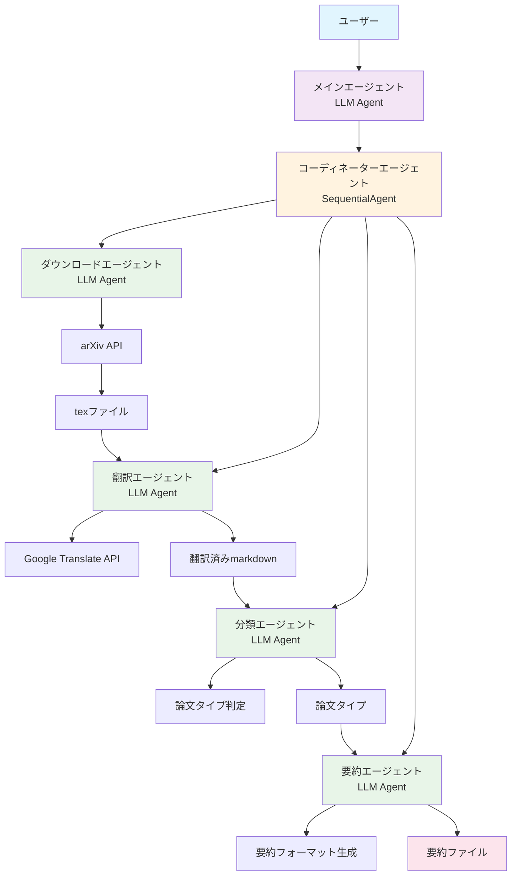
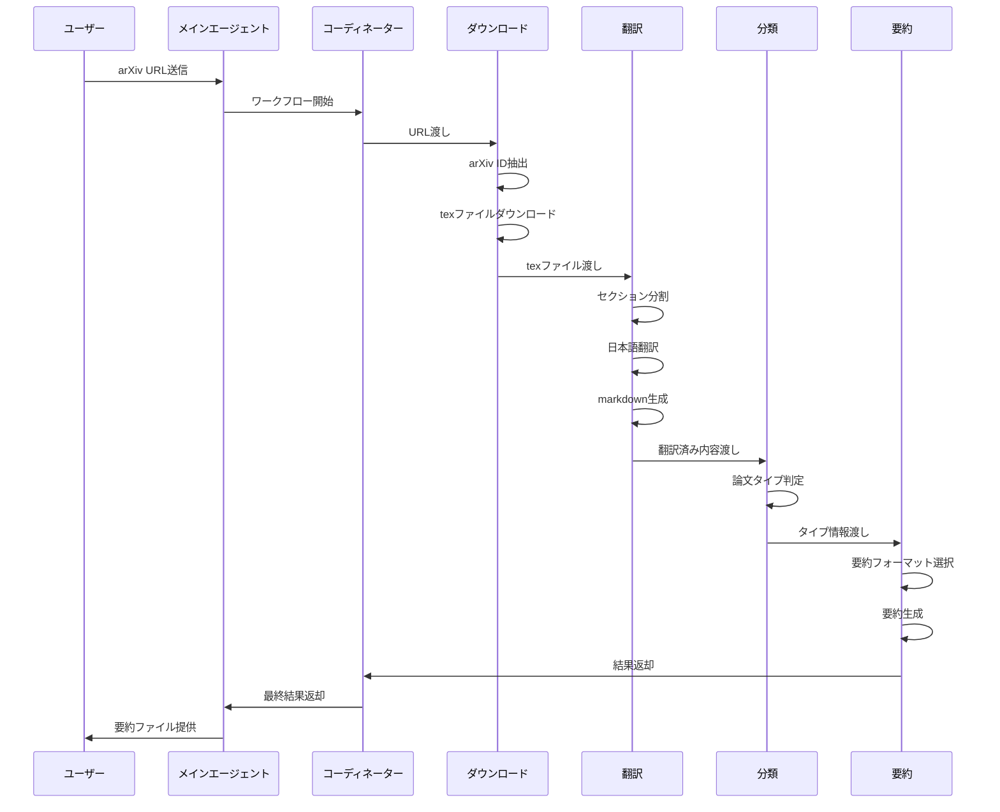

# arXiv Summary Agent

arXiv 論文の自動翻訳・要約システムです。URL を入力するだけで、論文を日本語に翻訳し、論文タイプに応じた要約を生成します。

## 機能

- 📥 arXiv URL から論文の tex ファイルを自動ダウンロード
- 🌐 論文の日本語翻訳（LLM 使用）
- 🔍 論文タイプの自動判定（研究論文/レビュー論文）
- 📝 論文タイプに応じた要約フォーマット生成
- 📄 Markdown 形式での出力

## システムアーキテクチャ

### マルチエージェントシステム（ADK 準拠）

本システムは Google ADK のベストプラクティスに従い、以下のエージェントで構成されています：



#### エージェント詳細

1. **メインエージェント** (`main_agent.py`)

   - ユーザーとの対話インターフェース
   - LLM Agent として実装

2. **コーディネーターエージェント** (`agents/coordinator_agent.py`)

   - SequentialAgent として実装
   - ワークフローの順序制御
   - 各専門エージェントの調整

3. **ダウンロードエージェント** (`agents/download_agent.py`)

   - LLM Agent として実装
   - arXiv URL の検証と tex ファイルのダウンロード

4. **翻訳エージェント** (`agents/translation_agent.py`)

   - LLM Agent として実装
   - tex ファイルのセクション分割と日本語翻訳

5. **分類エージェント** (`agents/classification_agent.py`)

   - LLM Agent として実装
   - 論文タイプの判定（研究論文/レビュー論文）

6. **要約エージェント** (`agents/summary_agent.py`)
   - LLM Agent として実装
   - 論文タイプに応じた要約フォーマット生成

### ワークフロー詳細



## 使用方法

### 基本的な使用方法

```python
from arxiv.main_agent import main_agent

# arXiv URLを指定
url = "https://arxiv.org/abs/1706.03762"

# 論文の処理を実行
result = main_agent.process_arxiv_paper_request(url)

if result["status"] == "success":
    print(f"論文ID: {result['arxiv_id']}")
    print(f"論文タイプ: {result['paper_type']}")
    print(f"翻訳ファイル: {result['translated_file']}")
    print(f"要約ファイル: {result['summary_file']}")
else:
    print(f"エラー: {result['message']}")
```

### 出力ファイル

1. **翻訳ファイル** (`translated_paper_X_sections.md`)

   - 元の書式を保持した日本語翻訳
   - セクション別の構造化された内容

2. **要約ファイル** (`summary_{paper_type}_{arxiv_id}.md`)
   - 論文タイプに応じた要約フォーマット
   - 研究論文またはレビュー論文の専用テンプレート

## 要約フォーマット

### 研究論文の要約フォーマット

```markdown
# 論文要約

## タイトル:

[論文のタイトルをここに記入 - タイトルは原文のまま出力]

## 発表年:

[発表された年をここに記入]

## 著者:

[著者の名前をここに記入]

## 著者の所属機関:

[著者の所属する組織や機関をここに記入]

## 要約:

[論文の主要な内容、結果、および結論を簡潔にまとめてここに記入]

## 使用された手法:

[論文で使用された新しい手法や技術をここに簡潔に記入]

## 技術の主要なポイント:

[論文で提案された技術の主要なポイントや特徴を箇条書きでここに記入]

## 先行研究との比較:

[この論文の技術やアプローチが先行研究と比較してどのような利点や新規性を持っているかをここに記述]

## 実験方法:

[論文で行われた実験や研究の方法をここに記述]

## 議論:

[論文の結果や結論に関する議論、今後の研究課題、さらなる研究の可能性などをここに記述]
```

### レビュー論文の要約フォーマット

```markdown
# レビュー論文要約

## タイトル:

[論文のタイトルをここに記入 - タイトルは原文のまま出力]

## 発表年:

[発表された年をここに記入]

## 著者:

[著者の名前をここに記入]

## 著者の所属機関:

[著者の所属する組織や機関をここに記入]

## 要約:

[論文の主要な内容、結果、および結論を簡潔にまとめてここに記入]

## 内容:

[論文の目的とレビュー/サーベイ内容などを解説]

## レビュー/サーベイ項目:

[論文で提案されたレビュー内容/サーベイ内容を箇条書きでここに記入]

## 比較:

[それぞれのレビュー内容/サーベイ内容 を表にしてわかりやすくする/ 論文中にある比較表などを引用する]

## 議論:

[論文の結果や結論に関する議論、今後の研究課題、さらなる研究の可能性などをここに記述]
```

## インストール

```bash
pip install -r requirements.txt
```

## 設定

翻訳機能を使用するには、Google Translate API の設定が必要です：

1. Google Cloud Console でプロジェクトを作成
2. Translate API を有効化
3. サービスアカウントキーを作成
4. 環境変数に設定：

```bash
export GOOGLE_APPLICATION_CREDENTIALS="path/to/your/service-account-key.json"
```

## 技術仕様

- **Python**: 3.8+
- **LLM**: Gemini 2.0 Flash
- **翻訳**: Google Translate API
- **出力形式**: Markdown
- **エージェントフレームワーク**: Google ADK

## ライセンス

MIT License

## 貢献

プルリクエストやイシューの報告を歓迎します。
