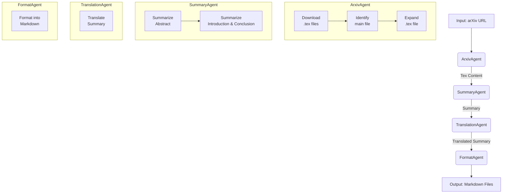

# Arxiv Summary Agent

arXiv 論文の自動要約・翻訳を行う AI エージェントです。論文の URL を入力するだけで、主要部分の要約、日本語への翻訳、指定フォーマットでの Markdown 出力までを自動で行います。

## 主な機能

- **論文の自動取得**: arXiv の URL から論文の TeX ソースファイルをダウンロードします。
- **重要部分の抽出・要約**: 論文の Abstract（要旨）、Introduction（序論）、Conclusion（結論）を抽出し、LLM を用いて要約します。
- **日本語への翻訳**: 生成された要約を日本語に翻訳します。
- **フォーマット整形**: 指定されたスタイル（レビュー形式、通常形式など）で Markdown ファイルとして出力します。
- **自動ワークフロー**: 上記の処理を複数の AI エージェントが連携し、自動で実行します。

## アーキテクチャ

本システムは、機能ごとに独立した複数の AI エージェントが連携して動作します。全体のワークフローは以下の通りです。



### エージェントの役割

1.  **ArxivAgent**: 指定された arXiv の URL から論文のソースファイルをダウンロードし、メインとなる TeX ファイルを特定後、すべての参照ファイルを展開して単一のファイルにまとめます。
2.  **SummaryAgent**: `ArxivAgent`から受け取った論文内容を基に、Abstract、Introduction、Conclusion の各セクションを個別に要約します。
3.  **TranslationAgent**: `SummaryAgent`が生成した英語の要約を日本語に翻訳します。
4.  **FormatAgent**: 翻訳された要約を受け取り、あらかじめ定義されたテンプレート（レビュー形式など）に合わせて Markdown ファイルとして整形し、出力します。

## インストール

必要なライブラリをインストールします。

```bash
pip install -r requirements.txt
```

## 使用方法

以下の Python コードを実行することで、エージェントを起動できます。

```python
from src.agent import root_agent

# arXivの論文URLを指定
arxiv_url = "https://arxiv.org/abs/1706.03762"

# エージェントを実行
result = root_agent.run(arxiv_url)

print(result)
```

実行が完了すると、`agent_outputs`ディレクトリ内に論文 ID ごとのフォルダが作成され、そこに要約と翻訳の Markdown ファイルが保存されます。

## ライセンス

[MIT License](LICENSE)
